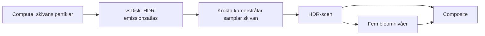

# Black hole – från partikeldata till böjda ljusbanor

Det fjärde läget i AETHER föreställer en ackretionsskiva runt ett svart hål. Paletten Gargantua är inspirerad av Interstellars varma bildspråk: bärnsten och guld utåt, vitgult material inåt, mot ett nästan svart rum. Det är en färggradering för utseendet, inte en spektral temperaturberäkning.

En ackretionsskiva är den ljusa strukturen runt hålet. Gravitationell linsning kan göra skivans baksida synlig ovanför och under centrumet. Se [NASA:s visualisering och förklaring av ljusbanorna](https://svs.gsfc.nasa.gov/13326). Filmens roterande Gargantua använder en betydligt mer avancerad modell; se [Kip Thornes beskrivning](https://www.its.caltech.edu/~kip/index.html/PubScans/VI-59.pdf).

## Partiklarna simulerar materialet

Preset 3 initierar partiklar i XZ-planet mellan radie 3,05 och 8,2. Tangentiell startfart och målhastighet följer `sqrt(42 / radius)`, så den inre skivan roterar snabbare än den yttre. Ett svagt radiellt bidrag driver materialet inåt; planar turbulens och muskrafter kan bryta upp skivan.

Y-positionen och Y-hastigheten sätts till noll efter uppdateringen. Detta är avsiktligt en tunn skiva. Partiklar innanför radie 2,5 återföds; även den vanliga livslängden återför material. Simuleringen bevarar inte massa eller energi och använder ingen relativistisk gasdynamik.

Stream-villkoren är begränsade till preset 2. Det svarta hålet får därmed varken Streams initiering eller dess teleportering från höger till vänster kant.

## Varför en extra textur?

Att bara rita 3D-partiklar med en projektionsmatris skulle visa en platt skiva. För att kunna följa böjda ljusbanor behöver vi veta vilket ljus som lämnar skivan vid en viss punkt.

`vsDisk` ritar därför de faktiska partikelposterna ovanifrån till en 1024×1024-textur i `rgba16float`. XZ-positionen blir UV, färgen följer radien och intensiteten kompenseras med `524288 / count`. En svag radiell modulation ger fina stråk. Partikelstorleken styr hur stor fläck varje partikel lämnar i atlasen.

Atlasen täcker −10…10 världsenheter längs både X och Z. Den rensas och byggs på nytt varje bildruta i Black hole-läget. När musen flyttar partiklarna ändras atlasen, och samma ändring syns i både direkt och gravitationellt böjt ljus.



## Böj en stråle från varje bildpunkt

`blackHoleShader` bygger kamerstrålen från `eye`, `right`, `up`, bildens proportioner och brännvidden som härleds ur projektionsmatrisen. Det gör att linsningen följer kameran även vid rotation och panorering.

Med Schwarzschildradien satt till 1 använder vi en Schwarzschild-inspirerad strålekvation:

```text
h² = |startposition × startriktning|²
a  = −1,5 × h² × position / |position|⁵
```

Integrationen använder position och hastighet med ett velocity-Verlet-liknande steg. Steglängden minskar nära centrum och ökar långt bort. Maximalt 180 steg ger en fast övre arbetsgräns per pixel. Strålen stoppas nära radie 1,02 eller när den lämnar området utåt.

När ett segment korsar skivplanet Y=0 interpolerar vi korsningspunkten och samplar atlasens ljus där. Strålar som böjs runt hålet kan korsa planet igen, så vi summerar flera bidrag med avtagande transmission. Dessa korsningar skapar de övre och undre ljusbågarna; de är inte separata ringar som lagts in i partikelvärlden.

Beräkningen är en begränsad realtidsapproximation. Den saknar Kerr-spinn, fullständig frekvenstransport och fysikaliskt korrekt radiometri. Skivan har ingen volymtjocklek; en exakt tangentiell stråle i skivplanet behandlas inte som ett volymintegralproblem. Det svaga ljusövertaget på den annalkande sidan är konstnärligt kalibrerat.

## Håll centrum mörkt

Vanlig bred bloom kan göra även hålets skugga grå. Black hole-läget dämpar därför bloom i den centrala skuggan, medan skivans direkta förgrundsljus behålls. Detta är ett uttryckligt visuellt val, inte ytterligare gravitationsfysik. Bloomreglaget fungerar fortfarande, och de tre tidigare formationerna behåller sin vanliga ljussättning.

## Kamera, färger och prestanda

Val av Black hole väljer en låg kameravinkel och Gargantua-paletten. Du kan sedan rotera, panorera, zooma eller prova andra färger. När du lämnar läget återställs föregående palett och standardkameran. `R` återställer den svarta hål-vyn när läget är aktivt.

Partikelposten är fortfarande 32 byte och maxantalet 4 194 304. Inget partikeldata läses tillbaka i den vanliga loopen. Atlasen tar ytterligare 8 MiB och ritas i ett extra renderpass: Black hole har 18 renderpass, övriga lägen 17. Strålspårningen kostar främst efter renderupplösning, medan compute och atlasritning även beror på partikelantalet.

För att undersöka effekterna: pausa och rotera kameran, stäng av bloom, dra material ur skivan och jämför 65K med 4M partiklar. Kör `tests/gpu-smoke.html` via den lokala servern för att kontrollera GPU-resurser, lägesbyten och partiklarnas tillstånd.
