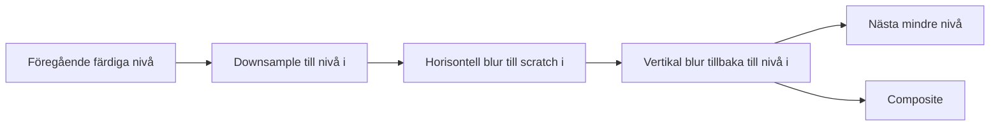

# Från GPU-partiklar till fluidliknande 3D – en tur genom AETHER

Den här guiden fortsätter där tutorialen för GeometryWars / NEON RIFT slutade. Den utgår från att du känner till rasterisering, shaders, buffrar och draw calls, kanske från OpenGL eller DirectX. Här följer vi hur några få styrsignaler från JavaScript blir till miljontals rörliga ljuspunkter i en tredimensionell volym.

Exemplen bygger på AETHERs nuvarande kod. Utdrag är ibland omformaterade eller förenklade; sådana förenklingar anges. Förslag på utbyggnader beskrivs separat från det som redan finns.

Ha gärna demon igång medan du läser: kör `npm start` i projektmappen och öppna [AETHER](http://127.0.0.1:5174). Börja med Vortex och 524 288 partiklar. Högerdrag roterar kameran, vänsterdrag påverkar partiklarna och `H` döljer gränssnittet. Alla kontroller finns i [README](../README.md).

## 1. Vad har ändrats sedan GeometryWars?

I GeometryWars skapade CPU:n startvärden för explosioner och skickade dessa till en GPU-pool. GPU:n skötte sedan partiklarnas rörelse och livslängd.

I AETHER har även **partiklarnas födelse flyttat till GPU:n**. JavaScript skickar inte en enda partikelposition vid vanlig körning. CPU:n beskriver kameran, musen och önskat flöde; compute shadern skapar och uppdaterar hela partikelpopulationen.

| Del | GeometryWars / NEON RIFT | AETHER |
| --- | --- | --- |
| Värld | 2D-arena i skärmkoordinater | 3D-värld med perspektivkamera |
| Partiklarnas startvärden | CPU-genererade emissioner | GPU-genererade formationer |
| Återanvändning | Emissioner skriver i en ringbuffer | Varje partikel återföds på sin egen plats |
| Partikelpost | 48 byte | 32 byte |
| Partikelantal | Fast poolkapacitet, varierande antal levande | Inställbart antal aktiva poster |
| Rörelse | Fart, gravitation, dämpning och väggstudsar | Analytiska flödesfält, tröghet och muskrafter |
| Bloom | Två blurpass i halv upplösning | Fem nivåer, var och en med separerbar blur |

Här finns inga spelregler som måste läsa partikelpositioner på CPU:n. Det låter oss behålla hela den löpande simuleringen i en storagebuffer.

## 2. Vem äger vilket tillstånd?

| Data | Uppdateras av | Lagring |
| --- | --- | --- |
| Tangenter, musknappar, paus och reglage | JavaScript | Objekt i `src/main.js` |
| Kameraposition, kamerabas och projektionsmatris | JavaScript | `Camera` i `src/math.js` |
| Gemensamma styrvärden för en bildruta | JavaScript | `Float32Array(48)` → uniformbuffer |
| Position, hastighet, frö och livslängd | Compute shaders | `particleBuffer` |
| Partikelgeometri | Vertex shadern | Beräknas vid rendering |
| Scenbild och utsmetat ljus | Fragment shaders | HDR- och bloomtexturer |


”GPU-minne” betyder här en resurs som hanteras via GPU-API:t. Det kan vara separat grafikminne eller fysiskt minne som delas med CPU:n. Det centrala är att JavaScript inte har en levande array med partiklarnas aktuella positioner.

## 3. Resurser, pipelines och bind groups

Öppna `Renderer.init()` i `src/renderer.js`. Den väljer en adapter, skapar en device och konfigurerar canvasen. `powerPreference: 'high-performance'` uttrycker en preferens vid adaptervalet.

Pipelineobjekten samlar shadersteg och renderingskonfiguration. En bind group pekar ut de konkreta resurserna som en pipeline ska använda. Om du tänker i OpenGL-termer: här väljer vi färdiga konfigurationer och resursgrupper i stället för att stegvis ändra en stor implicit global state.

| Pipeline | Entry point | Arbete |
| --- | --- | --- |
| `initPipeline` | `init` | Skapa alla startposter |
| `computePipeline` | `update` | Uppdatera och återföda partiklar |
| `particlePipeline` | `vs` + `fs` | Rita partiklar till HDR-scenen |
| `bloomPipeline` | `vs` + `fs` | Filtrera och skala ned en bild |
| `blurPipelines[0]` | `vs` + `horizontal` | Horisontell blur |
| `blurPipelines[1]` | `vs` + `vertical` | Vertikal blur |
| `compositePipeline` | `vs` + `fs` | Kombinera ljus och presentera |

För initiering och uppdatering ser shaderns resurskontrakt ut så här:

```wgsl
@group(0) @binding(0) var<uniform> u: Uniforms;
@group(0) @binding(1) var<storage, read_write> particles: array<Particle>;
```

Rendering använder samma partikelbuffer som `var<storage, read>`. Varje pipeline har sin egen bind group, skapad via `getBindGroupLayout(0)`, eftersom projektet använder `layout: 'auto'`.

Att skriva nya värden till en redan bunden buffer kräver ingen ny bind group. När `setCount()` ersätter själva partikelbuffern måste däremot de tre grupper som refererar till den återskapas. `resize()` gör motsvarande sak för texturer och deras grupper.

### Gränserna är en del av initieringen

Maxantalet räknas från både `maxStorageBufferBindingSize` och `maxBufferSize`, avrundas ned till hela grupper om 256 och begränsas dessutom till 4 194 304. En resurs måste både få allokeras och få bindas i sin helhet.

`requiredLimits` begär sedan dessa buffergränser för devicen. Läs kapaciteten från den adapter och device som faktiskt används; hårdkoda inte antaganden om användarens grafikkort. Se [GPUDevice.limits](https://developer.mozilla.org/en-US/docs/Web/API/GPUDevice/limits).

Detta kontrollerar tillåtna resursstorlekar. Det lovar varken ledigt fysiskt minne eller en viss bildhastighet.

## 4. En 3D-partikel ryms i 32 byte

Partikelstrukturen finns överst i `src/shaders.js`:

```wgsl
struct Particle {
  position: vec4f,
  velocity: vec4f,
};
```

| Innehåll | Byte-offset | Storlek | Float-index i en post |
| --- | ---: | ---: | --- |
| `position.xyz`: världsposition | 0 | 12 byte | 0–2 |
| `position.w`: slumpvärde för variation | 12 | 4 byte | 3 |
| `velocity.xyz`: hastighet | 16 | 12 byte | 4–6 |
| `velocity.w`: återstående livslängd | 28 | 4 byte | 7 |
| **Hela posten** | | **32 byte** | **8 floats** |

`position.w` är alltså inte den homogena koordinaten för projektion. När positionen ska projiceras bygger vertex shadern uttryckligen `vec4f(p.position.xyz, 1.)`.

Två `vec4f` ger enkel packning och plats för metadata. WGSL ger `vec3f` storlek 12 men alignment 16; två nakna `vec3f` skulle därför inte automatiskt ge en 24-byte-struktur. Se [WGSL:s regler för alignment och storlek](https://www.w3.org/TR/WGSL/#alignment-and-size).

Buffern skapas med:

```js
this.particleBuffer = this.device.createBuffer({
  size: count * 32,
  usage: GPUBufferUsage.STORAGE | GPUBufferUsage.COPY_SRC,
});
```

Den används som shaderlagring, inte som en traditionell vertexbuffer med attributes. `COPY_SRC` gör framtida felsökningskopiering möjlig. Den normala renderloopen kopierar inte ut partiklarna. Vi behöver ingen `COPY_DST` för CPU-genererade emissioner, eftersom `init` och `spawn` skriver startvärdena på GPU:n.

## 5. CPU:n skickar en beskrivning av bildrutan

Uniformstrukturen består av en matris och åtta `vec4f`: totalt **192 byte**. CPU:n packar dem i `this.uniforms`, en återanvänd `Float32Array(48)`.

| Fält | Byte-offset | Float-index | Betydelse |
| --- | ---: | --- | --- |
| `vp` | 0 | 0–15 | Projektion × view |
| `right` | 64 | 16–19 | Kamerans högervektor, sedan 0 |
| `up` | 80 | 20–23 | Kamerans uppvektor, sedan 0 |
| `eye` | 96 | 24–27 | Kamerans världsposition, sedan 0 |
| `pointer` | 112 | 28–31 | Kraftcentrum XYZ och signerad styrka |
| `timing` | 128 | 32–35 | Delta-tid, simuleringstid, antal, 0 |
| `flow` | 144 | 36–39 | Turbulens, hastighetsreglage, muskraft, formation |
| `render` | 160 | 40–43 | Storlek, bloom, exponering, palett |
| `misc` | 176 | 44–47 | Renderbredd, renderhöjd, impuls, globalt frö |

`right` och `up` packas redan här, men nuvarande partikelshader använder skärmriktningen hos en projicerad hastighet för att bygga strecket. Kamerabasen används av CPU:n för bland annat musplanet.

Efter packningen sker ett uppladdningsanrop:

```js
this.device.queue.writeBuffer(this.uniformBuffer, 0, this.uniforms);
```

Samma 192 byte styr både 65 536 och 4 194 304 partiklar. Vid 120 bildrutor per sekund är nyttolasten 23 040 byte/s. Detta räknar uniformdata, inte API-overhead, GPU-kommandon eller intern GPU-trafik.

## 6. Födelse och återfödelse på GPU:n

`setCount()` allokerar buffern och sätter `needsReset = true`. Vid nästa bildruta kör renderern först `init`:

```wgsl
@compute @workgroup_size(256)
fn init(@builtin(global_invocation_id) id: vec3u) {
  if (id.x >= u32(u.timing.z)) { return; }
  particles[id.x] = spawn(id.x, 0u);
}
```

`spawn(i, epoch)` hashar partikelindex, en epok och det globala fröet. Från resultatet härleds vinklar, radier, livslängd och variation. Varje invocation kan skapa sin partikel utan delad slumpgenerator eller samordning med grannarna.

I Vortex läggs startpositionerna runt en ring. Förenklat:

```text
x = (stor radie + cos(b) × liten radie) × cos(a)
y = sin(b) × liten radie + våg längs ringen
z = (stor radie + cos(b) × liten radie) × sin(a)
```

`a` väljer läge längs ringen, `b` läge runt rörets tvärsnitt och den lilla radien sprider punkterna genom rörets tjocklek. Fördelningen är vald för utseendet och är inte ett löfte om jämn densitet per volymenhet.

Nebula börjar i en hoptryckt sfärisk volym. Stream delar partiklarna i fem grupper med `i % 5u` och placerar dem runt fem fasförskjutna helixar.

När livet tar slut eller en partikel hamnar mer än 24 världsenheter från origo anropas `spawn` igen från `update`. Samma bufferpost får ett nytt innehåll. Ingen CPU-lista med fria platser behövs.

Startlivslängden är 8–30 simuleringssekunder. Vid återfödelse skrivs den över med 22–42 sekunder. Ljuset tonas ned under de sista 1,5 sekunderna. Återfödelsen håller populationen fylld och tillför nytt material till flödet.

### Tre olika sorters omstart

| Handling | Vad händer? |
| --- | --- |
| Byta antal | Ny buffer och nya bind groups; alla partiklar initieras |
| Byta formation | Samma buffer; nytt globalt frö, tiden nollas, partiklar initieras |
| `R` eller Återställ | Samma simuleringsreset och dessutom återställd kamera |

Byte av antal nollar inte `renderer.time`. Återställ återställer inte alla ljus- och flödesreglage till standardvärden.

## 7. En invocation uppdaterar en partikel

CPU:n skickar:

```js
compute.dispatchWorkgroups(Math.ceil(this.count / 256));
```

Det ger följande arbetsmängd:

| Partiklar | Workgroups | Invocations per workgroup |
| ---: | ---: | ---: |
| 65 536 | 256 | 256 |
| 524 288 | 2 048 | 256 |
| 1 048 576 | 4 096 | 256 |
| 4 194 304 | 16 384 | 256 |

Det beskriver hur arbetet delas upp, inte hur många hårdvarutrådar som kör exakt samtidigt. GPU:n schemalägger grupperna över sina exekveringsenheter.

Förenklat gör `update` detta:

```text
Läs particles[i]
  → beräkna formationens flödeshastighet vid positionen
  → lägg till turbulent fält
  → låt partikelns hastighet närma sig flödets
  → lägg till muskraft och eventuell impuls
  → begränsa farten
  → flytta och åldra partikeln
  → återföd vid behov
Skriv particles[i]
```

Varje invocation läser och skriver bara sin egen partikelpost. Vi kan därför uppdatera på plats utan dubbla partikelbuffrar, atomics eller barriärer inne i shadern.

Om vi senare börjar läsa grannpartiklar behöver arkitekturen ändras. En granne kan annars hinna uppdateras innan vi läser den. En workgroupbarriär löser inte ett beroende mellan alla grupper; dess räckvidd är den egna workgroupen. Se [WGSL:s synkroniseringsfunktioner](https://www.w3.org/TR/WGSL/#synchronization-builtin-functions).

## 8. Varför ser det ut som en fluid?

Det synliga flödet kommer från att närliggande partiklar påverkas av samma mjukt varierande funktion av position och tid. Vi kastar inte om varje partikels riktning med oberoende slump varje bildruta. När en del av fältet svänger följer många partiklar med och bildar band, veck och virvlar.

Funktionen `curl(p, t)` summerar två ABC-liknande fält i olika rumsliga skalor. Om vi tillfälligt tar bort frekvenser, tidsförskjutningar och vikter ser en del ut så här:

```text
F(x, y, z) = (
  sin(z) + cos(y),
  sin(x) + cos(z),
  sin(y) + cos(x)
)
```

Det finns en användbar egenskap: X-komponenten beror inte på X, Y-komponenten inte på Y och Z-komponenten inte på Z. Därför blir:

```text
div F = ∂Fx/∂x + ∂Fy/∂y + ∂Fz/∂z
      = 0 + 0 + 0
      = 0
```

Fältet är divergensfritt. Som kontinuerligt hastighetsfält har det ingen lokal volymkälla eller volymsänka. En viktad summa av de två sådana fälten behåller den egenskapen, även med kodens tidsberoende faser.

I koden arbetar det första fältet med `p * .82`, det andra med `p * 1.93`. Det andra bidrar med vikten `.32`. Större strukturer får alltså en mindre, finare variation ovanpå sig. Reglaget Turbulens multiplicerar det samlade bidraget.

### Vad betyder namnet `curl` här?

Funktionen beräknar direkt ett analytiskt fält med virvlande rörelse. Den tar inte numeriska derivator av en generell noise-funktion och implementerar inte en komplett curl-noise-algoritm.

**Det totala partikelflödet är inte garanterat divergensfritt.** Formationernas sammanhållning, musens attraktion, hastigheternas tröghet, återfödelse och numerisk integration tillkommer. Partiklar kan därför koncentreras till mycket täta stråk, vilket är en stor del av utseendet.

Vi löser inte tryck, densitet, viskositet eller kollisioner mellan partiklar. Det fluidliknande resultatet uppstår genom sammanhängande rörelsefält och ljusackumulering.

## 9. Formationerna ger flödet en övergripande form

### Vortex: cirkulera, snurra och håll ihop

Shadern bygger först en radial riktning i XZ-planet och en tangent vinkelrätt mot den:

```wgsl
let radius = max(length(pos.xz), .001);
let radial = vec3f(pos.x / radius, 0., pos.z / radius);
let tangent = vec3f(-radial.z, 0., radial.x);
```

Ringens radie och höjd varierar långsamt med vinkel och tid. `tube` är förskjutningen från denna lokala ringmitt till partikeln. Sedan kombineras tre delar:

```wgsl
var flowVelocity =
    tangent * 2.2
  + cross(tangent, tube) * 1.6
  - tube * .48;
```

| Term | Effekt |
| --- | --- |
| `tangent * 2.2` | Förflytta partikeln längs den stora ringen |
| `cross(tangent, tube) * 1.6` | Snurra runt rörets tvärsnitt |
| `-tube * .48` | Dra rörelsen mot ringens mittlinje |

Det här är en önskad hastighet, inte tre direkt applicerade accelerationskrafter. Partikelns nuvarande hastighet anpassas till den i nästa steg.

### Nebula: långsam rotation i en volym

Nebula använder en mjuk rotation runt Y-axeln, en vertikal våg och svag dragning mot centrum. Utanför radie 5 tillkommer ett inåtriktat bidrag. Det håller molnet i bild medan turbulensen veckar det.

### Stream: fem framåtriktade strömmar

Varje partikel har en av fem faser utifrån sitt index. Målhastigheten pekar framåt längs X och följer en helix i YZ. Ett återförande bidrag drar partikeln mot dess helix.

När X passerar 7,5 subtraheras 15 så att partikeln återkommer på vänster sida. Det är en visuell återcirkulation. Helixfasen är inte exakt periodisk över denna sträcka med nuvarande `.65`, så övergången är ingen fysikaliskt kontinuerlig periodisk rand.

## 10. Tröghet och tidssteg

Partikeln får inte omedelbart flödesfältets hastighet. Den närmar sig den med:

```wgsl
var vel = mix(
  p.velocity.xyz,
  flowVelocity,
  1. - exp(-dt * 2.4)
);
```

För ett konstant målvärde motsvarar detta exponentiell anpassning. Vid `dt = 1/60` flyttas hastigheten ungefär 3,9 procent av den återstående skillnaden per steg. Höjer du `2.4` följer partikeln fältet hårdare; sänker du värdet behåller den sin tidigare rörelse längre.

Efter muskraft och impuls begränsas farten till 16, och positionen integreras:

```wgsl
vel *= min(1., 16. / max(length(vel), .001));
p.position = vec4f(pos + vel * dt, p.position.w);
p.velocity = vec4f(vel, p.velocity.w - dt);
```

JavaScript begränsar verkligt förfluten tid till högst 0,05 sekunder för simuleringen. Shadern multiplicerar sedan med hastighetsreglaget. Vid reglagets maxvärde 2 kan det effektiva steget alltså bli 0,1 sekunder.

`renderer.time` ökas också med delta-tid gånger hastighetsreglaget. Fältets egen animation, partiklarnas rörelse och livslängden följer därmed samma simuleringsklocka. Det är inte en dubbel multiplikation på positionssteget: tiden styr fältets fas och `dt` styr integrationen.

Exponentialformen gör anpassningen mindre känslig för bildhastighet, men hela simuleringen är fortfarande numerisk och tidsstegsberoende. Vid långa bildrutor kastas tid bort av begränsningen; vi kör inte flera steg för att hinna ikapp.

Vid paus skickas `dt = 0`. `update` returnerar då direkt. Kameran och renderingen fortsätter, så du kan röra dig runt en frusen formation.

## 11. Kameran: från världsposition till clip space

`Camera` i `src/math.js` beskriver en orbitkamera med en flyttbar fokuspunkt:

```text
eye = target + distance × (
  sin(yaw) × cos(pitch),
  sin(pitch),
  cos(yaw) × cos(pitch)
)
```

Högerdrag ändrar `yaw` och `pitch`. Mushjulet ändrar avståndet till fokus, begränsat till 3–60. WASD flyttar fokus och därmed även kameran längs dess framåt- och högervektorer. Q/E flyttar längs världens Y-axel.

Kamerabasen blir:

```text
forward = normalize(target - eye)
right   = normalize(cross(forward, worldUp))
up      = cross(right, forward)
```

Pitch begränsas till ±1,5 radianer så att kameran inte når exakt den pol där `forward` och `worldUp` blir parallella.

View-matrisen omvandlar världen till kamerans koordinater. Perspektivmatrisen ger perspektivförkortning. Vi lagrar matriser kolumnvis och räknar:

```js
this.vp = multiply(perspective(this.fov, aspect, .1, 150), view);
```

Shadern använder sedan:

```wgsl
let clip = u.vp * vec4f(p.position.xyz, 1.);
```

Efter perspektivdivisionen blir XY skärmpositionen. Projektets perspektivmatris mappar närplanet till djup 0 och fjärrplanet till 1. En klassisk OpenGL-projektion som mappar djup till −1…1 kan därför inte kopieras hit oförändrad.

Kameratesterna i `tests/math.test.mjs` verifierar just djupmappningen, kamerabasens ortogonalitet och att musplanet projiceras tillbaka till rätt skärmpunkt.

## 12. Hur blir en 2D-mus en kraft i 3D?

En skärmpunkt anger en stråle genom världen, inte ett entydigt 3D-djup. AETHER väljer ett plan genom kamerans fokuspunkt, vinkelrätt mot kamerans blickriktning.

Först räknar `main.js` om musen till normaliserade koordinater:

```js
const nx = pointer.x / canvas.clientWidth * 2 - 1;
const ny = 1 - pointer.y / canvas.clientHeight * 2;
```

I `Camera.pointer()` används sedan:

```text
halfHeight = tan(fov / 2) × distance
worldPoint = target
           + right × nx × halfHeight × aspect
           + up    × ny × halfHeight
```

Det är skärmpunktens läge på det valda planet. Vi behöver ingen invers matris eller GPU-readback för denna konstruktion.

Muskoordinaterna är CSS-pixlar. De faktiska rendertexturerna kan ha en annan upplösning. Normaliseringen gör att musen ändå hamnar rätt när renderern skalar upplösningen.

### Planet väljer centrum; kraften påverkar en volym

Vi laddar upp `worldPoint` i `u.pointer.xyz`. Varje partikel räknar sedan:

```wgsl
let delta = u.pointer.xyz - pos;
let d2 = dot(delta, delta);
let falloff = exp(-d2 / 10.);
```

Avståndet är tredimensionellt. Kraften gäller alltså även partiklar framför och bakom planet, med mjuk avtoning. Vid avståndet `sqrt(10)` återstår cirka 37 procent av just avtoningsfaktorn. Själva attraktionsledet multipliceras dessutom med `delta`.

Den direkta hastighetsändringen är, utdragen ur den större formeln:

```wgsl
delta * u.pointer.w * 3.8 * falloff * u.flow.z * dt
```

`u.pointer.w` är normalt `0.12` vid hover och `1` vid vänsterdrag. Shift byter tecken. `u.flow.z` är reglaget Muskraft.

Ett extra kryssproduktled ger rotation runt axeln mellan kraftcentrum och kameran. Det använder absolutbeloppet av styrkan, så Shift vänder den direkta attraktionen men inte tecknet på virvelbidraget. Axelvektorn är inte normaliserad i nuvarande kod: även kameraavståndet påverkar virvelns styrka.

När höger- eller mittenknappen används för kameran stängs muskrafterna av. `B` lägger i stället en engångsimpuls radiellt från världens origo. Den multipliceras inte med `dt`, eftersom den är ett engångstillskott till hastigheten.

## 13. Följ en hel bildruta genom GPU-kön

`Renderer.frame()` spelar in följande arbete:

```text
CPU: uppdatera uniformbuffer

Compute pass
  init, om needsReset
  update

Render pass: partiklar → HDR-scen

För fem bloomnivåer:
  Render pass: föregående bild → mindre bild
  Render pass: horisontell blur → scratch
  Render pass: vertikal blur → nivåns bild

Render pass: scen + fem bloomnivåer → canvas

queue.submit
```

Det blir ett compute-pass och **17 renderpass** per vanlig bildruta: 1 för scenen, 15 för bloom och 1 för slutbilden. Initiering är en extra dispatch i det befintliga compute-passet när den behövs.

`GPUCommandEncoder` spelar in arbetet; `finish()` producerar en command buffer som lämnas till kön. Inspelningen innebär inte att CPU:n själv utför beräkningarna. Se [GPUCommandEncoder](https://developer.mozilla.org/en-US/docs/Web/API/GPUCommandEncoder).

Init skriver buffern före update. Update skriver före partikelrenderingen läser. Varje bloompass producerar bilden som nästa behöver. Det är ordnade resursberoenden, utan någon CPU-readback mellan stegen.

Alla dessa pass läser medvetet samma bildruteuniforms. En bind group lagrar resursreferenser, inte en kopia av bufferns innehåll vid en viss draw. Vill du senare använda olika uniformvärden för flera draws behöver de få separata bufferområden eller buffrar.

## 14. Från en post till två trianglar

Partiklarna ritas med ett enda anrop:

```js
scene.draw(6, this.count);
```

Sex vertices ger två trianglar per instans. `instance_index` väljer partikelposten och `vertex_index` väljer ett hörn ur en liten konstant array. Ingen mesh med miljontals quads byggs i JavaScript.

För att hitta streckets riktning projicerar shadern två punkter:

```wgsl
let clip = u.vp * vec4f(p.position.xyz, 1.);
let next = u.vp * vec4f(p.position.xyz + p.velocity.xyz * .035, 1.);
```

Skillnaden mellan deras perspektivdividerade XY-koordinater ger hastighetsriktningen på skärmen. Rörelse rakt mot kameran ger därför mindre utsträckning än lika snabb rörelse tvärs över bilden.

`delta` multipliceras med renderbredd och renderhöjd. Det gör dess riktning rätt för bildens proportioner. Storleken är proportionell mot pixelförflyttning, men saknar faktorn `0.5` för en exakt NDC-till-pixel-konvertering; den efterföljande strecklängden är konstnärligt kalibrerad med `.35`.

En normal vinkelrätt mot skärmriktningen ger bredden. Den ungefärliga perspektivskalningen är:

```wgsl
let perspective = clamp(16. / max(clip.w, .1), .5, 2.5);
let width = u.render.x * perspective;
```

Pixeloffseten omvandlas tillbaka till clip space:

```wgsl
let offset = (direction * corner.x * stretch
            + normal * corner.y * width) * 2. / u.misc.xy;
o.position = clip + vec4f(offset * clip.w, 0., 0.);
```

Multiplikationen med `clip.w` gör att offseten får avsedd storlek efter perspektivdivisionen.

Strecket beskriver hastigheten just nu. Vi lagrar ingen positionshistorik, och HDR-bilden rensas varje bildruta. De långa synliga banden uppstår när många partiklar samtidigt fyller samma rörelsebanor.

## 15. Färg, genomskinlighet och täta ljusstråk

Fragmentshadern gör quaden till en mjuk ljusfläck:

```wgsl
let r2 = dot(o.local, o.local);
let glow = exp(-r2 * 3.8) * (1. - smoothstep(.6, 1., r2));
return vec4f(o.color * glow, 1.);
```

Eftersom geometrin kan vara utdragen blir profilen en mjuk ellips. Den runda profilen i lokala koordinater och partikelns utsträckning är två separata delar.

Färgen bestäms av ett mjukt band genom världspositionen:

```wgsl
let band = sin(pos.x*.38 + pos.z*.31 + pos.y*.45
               + u.timing.y*.06) * .5 + .5;
let hot = smoothstep(.48, .9, band);
```

`hot` blandar palettens två RGB-färger. Därför får närliggande delar av volymen sammanhängande färger. Det sparade slumpvärdet och farten varierar ljusstyrkan; djup och återstående liv tonar ned bidraget.

### Additiv blending gör täthet till ljus

Pipelinekonfigurationens RGB-blending använder `one + one`. Varje fragment adderar sitt ljus till det som redan finns där. Alpha används inte som vanlig transparensvikt; intensitetsavtoningen sker i RGB.

Vi har ingen depth attachment och sorterar inte partiklarna från bakgrund till förgrund. De bildar ett genomlysande, emitterande moln. Ljuset ackumuleras utan en modell för absorption, skuggor eller en vätskeyta. Djupavtoningen hjälper läsbarheten men ersätter inte fysisk ocklusion.

### Varför blir inte fyra miljoner partiklar bara vitt?

Ljusstyrkan per partikel skalas med:

```wgsl
let density = pow(524288. / u.timing.z, .68);
```

Åtta gånger fler partiklar ger då ungefär 0,243 gånger ljuset per partikel. Totalt ljus blir fortfarande ungefär 1,95 gånger större vid samma fördelning. Kompensationen är alltså partiell: högre täthet får synas, men ska inte helt förstöra färgerna.

Tätare banor kan fortfarande bli mycket ljusa. Antal, storlek, bloom och exponering samverkar.

## 16. Bloom i fem skalor

Partiklarna ritas till `rgba16float`: fyra 16-bitars flyttalskanaler, totalt 8 byte per pixel. Scenen kan därmed ackumulera ljusvärden över 1 innan resultatet tonmappas.

För varje bloomnivå halveras både bredd och höjd:

| Resurs | Storlek jämfört med scenen | Pixelandel |
| --- | --- | ---: |
| `views[0]` | W × H | 1 |
| `views[1]` / `bloom0` | W/2 × H/2 | 1/4 |
| `views[2]` / `bloom1` | W/4 × H/4 | 1/16 |
| `views[3]` / `bloom2` | W/8 × H/8 | 1/64 |
| `views[4]` / `bloom3` | W/16 × H/16 | 1/256 |
| `views[5]` / `bloom4` | W/32 × H/32 | 1/1024 |

Dimensionerna avrundas ned och är minst en pixel. Det är separata texturer, inte automatiskt genererade mip-nivåer av en gemensam textur.



Scratchtexturen hindrar att blurpasset måste läsa och skriva samma bild samtidigt. Nästa nivå utgår från den redan suddade föregående nivån.

Downsample använder ett viktat mönster med nio samplingar. Blur delas upp i en horisontell och en vertikal riktning. Varje riktning använder fem linjärfiltrerade samplingar med fraktionella offsets; filtreringen kombinerar närliggande texlar till en bredare Gaussliknande kärna.

De stora bloomtexturerna bevarar en halo nära stråken. De små sprider ljuset över större skärmavstånd. Att sudda hela scenen lika mycket hade gjort det svårare att behålla skarpa kärnor och bred glöd samtidigt.

### Slutpasset

De fem nivåerna summeras med vikterna `0.3, 0.5, 0.8, 1.1, 1.5`. Originalscenen läggs sedan ihop med bloom:

```wgsl
let hdr = (base + bloom * u.render.y) * u.render.z;
let mapped = 1. - exp(-hdr);
```

`render.y` är bloomreglaget och `render.z` exponeringen. Tonmappningen komprimerar höga värden mjukt. Därefter används `pow(mapped, vec3f(1./2.2))` som en enkel gammakurva, följt av bakgrund, vinjett och en mycket svag, skärmfast kornighet. Gammakurvan är en approximation, inte sRGB:s exakta styckvisa transferfunktion.

Det finns inget separat bright-pass: hela partikelbilden bidrar till bloom. Vid bloom 0 finns partiklarnas egen mjuka profil kvar, men det extra utsmetade ljuset försvinner.

**Bloom 0 sparar inte blurpassen i nuvarande kod.** Renderern kör dem ändå; slutpasset multiplicerar bara bidraget med noll.

## 17. Fyra miljoner partiklar: var hamnar kostnaden?

| Partiklar | Partikelbuffer | Begärda vertices per bildruta |
| ---: | ---: | ---: |
| 65 536 | 2 MiB | 393 216 |
| 262 144 | 8 MiB | 1 572 864 |
| 524 288 | 16 MiB | 3 145 728 |
| 1 048 576 | 32 MiB | 6 291 456 |
| 2 097 152 | 64 MiB | 12 582 912 |
| 4 194 304 | 128 MiB | 25 165 824 |

UI:t skriver MB, men räknar med 1024² byte, alltså MiB. Tabellen gäller partikelbuffern; texturer och andra resurser tillkommer.

### Compute och minnestrafik

En förenklad räkning med 32 byte läsning och 32 byte skrivning per uppdatering ger 256 MiB per bildruta vid maxantalet. Vid 120 FPS motsvarar det 30 GiB/s. Det är en uppskattning av logisk datamängd, inte uppmätt trafik till grafikminnet: cache, kompilering och hårdvaran påverkar den faktiska trafiken.

Vertexstegets läsningar, sinus/cosinus-beräkningar, rasterisering, blending och postprocess tillkommer. Att CPU-uppladdningen är liten gör inte GPU-arbetet gratis.

### Overdraw

Om många quads täcker samma pixel körs många fragment och många blendoperationer där. Det kan bli dyrare än själva positionsintegrationen. Större partiklar ökar täckt yta, och tätare kameravyer samlar mer arbete i samma bildområden.

Antalsreglaget ändrar faktiskt bufferstorlek, dispatchstorlek och instansantal. Det skiljer sig från GeometryWars densitetsreglage, som filtrerade emissioner till en fortsatt lika stor pool.

### Renderupplösning och texturminne

`resize()` väljer skalfaktorn från skärmens pixel ratio, taket 1,5, ungefär 2,4 miljoner renderpixlar och GPU:ns dimensionsgräns. Även på en stor skärm kan scenen alltså renderas i lägre upplösning än skärmens fulla pixeltäthet.

Fem bloomtexturer plus deras fem scratchtexturer upptar tillsammans ungefär två tredjedelar av scenens pixelmängd. Med själva scenen blir det cirka `1.666 × W × H × 8` byte. Vid 2,4 miljoner renderpixlar är det ungefär 30,5 MiB, utöver partikelbuffern, canvasens resurser och implementationens overhead.

### FPS-texten är ingen GPU-profiler

Mätaren räknar bildrutor per verkligt tidsintervall i JavaScript. Den visar varken tiden för compute separat eller när varje GPU-operation avslutades. Projektet använder inga timestamp queries.

De cirka 100–120 FPS som observerades med maxantalet under den första testningen beskriver en viss NVIDIA-GPU och testvy. Använd det som en observation, inte en garanti för andra upplösningar, formationer eller maskiner.

## 18. Felsök från den första felande länken

Vid start kontrollerar renderern `getCompilationInfo()` för varje shadermodul. Pipelinevalidering fångas med en error scope, och okontrollerade GPU-fel samt förlorad device visas i gränssnittet.

Ett praktiskt exempel från bygget: namnet `target` fungerade i JavaScript men stoppade WGSL-kompileringen eftersom det är reserverat där. Shaderns variabel heter därför `flowVelocity`. WGSL-liknande syntax betyder inte att alla JavaScript- eller GLSL-namn är tillåtna.

| Symptom | Börja här |
| --- | --- |
| Felpanel direkt vid start | Kompileringsmeddelande, radnummer och shaderetikett |
| Gammal bild efter shaderändring | Ladda om; projektet har ingen hot reload |
| Allt blir vitt | Exponering, bloom, partikelstorlek och densitetskompensation |
| Musen träffar oväntat djupt | Fokusplanet väljer kraftens 3D-centrum |
| Flödet ändrar karaktär vid låg FPS | Begränsat variabelt tidssteg och tröghetsintegration |
| Fel vid ökat partikelantal | Buffergränser, allokering och GPU-fel |
| Låg FPS även med bloom 0 | Blur körs fortfarande; även compute och partiklar kostar |

I webbläsarkonsolen kan du läsa:

```js
window.aether.diagnostics
```

Det visar bland annat antal, maxantal, bildrutor, fångade fel, kameradata och renderstorlek. Det innehåller inte GPU-partiklarnas positioner.

`npm test` kör de tre kameratesterna. De kontrollerar matematiken på CPU:n; shaderkompilering och det visuella resultatet behöver fortfarande köras i en WebGPU-webbläsare.

## 19. Experiment att göra i ordning

Ändra en sak i taget. Ladda om efter kodändringar, och använd återställning för att börja från en ny formation. Sänk gärna antalet medan du undersöker en shaderändring.

| Experiment | Var? | Vad du lär dig |
| --- | --- | --- |
| Sätt Turbulens till 0 i Vortex | UI | Skilj ringens grundrörelse från det extra fältet |
| Prova bara `tangent * 2.2` som Vortex-hastighet, med turbulens 0 | `simulation` i `src/shaders.js` | Isolera cirkulationen längs ringen |
| Sätt rörets kryssproduktled till 0 | Samma Vortex-formel | Se vad rotationen runt tvärsnittet bidrar med |
| Ändra tröghetskoefficienten `2.4` till `0.8` respektive `8.` | `update` | Jämför eftersläpning med hård följsamhet |
| Ändra den finare fältvikten `.32` till `0` | `curl` | Undersök hur två skalor bryter upp strukturen |
| Använd `let stretch = width;` | Partikelshaderns vertexsteg | Skilj ljuspunkter från hastighetsstreck |
| Pausa, rotera och zooma | Mus och tangentbord | Skilj verklig 3D-form från rörelseintrycket |
| Sätt Bloom till 0 | UI | Se den direkta partikelljussättningen |
| Ändra densitetsexponenten `.68` till `1.` | Partikelshadern | Prova starkare normalisering över olika antal |
| Ändra `exp(-d2/10.)` till `exp(-d2/3.)` | Muskraften i `update` | Gör kraftens volym mer lokal |
| Prova workgroupstorlek 128 | Både `init`, `update` och båda dispatch-divisorerna | Mät arbetsgruppsval separat från partikelantal |

Workgroupstorleken används även i maxantalets avrundning i `Renderer.init()`. Uppdatera den också om du vill hålla konfigurationen konsekvent. Att enbart ändra annotationen lämnar dispatchens storlek fel.

## 20. Vad krävs för att gå vidare?

Följande är möjliga utbyggnader och finns inte i nuvarande implementation.

### Flera muskällor eller andra krafter

Lägg kraftbeskrivningar i en liten buffer: position, typ, radie och styrka. Varje partikel summerar deras påverkan. Då kan exempelvis flera gravitationsbrunnar leva kvar när musen flyttas vidare. Kostnaden växer med antalet partiklar gånger antalet kraftkällor.

### Stabilare numerik

En ackumulator med fasta simuleringssteg skulle göra rörelsen mer konsekvent mellan bildhastigheter. Alternativt kan stora steg delas upp. Flera compute-dispatches behöver få rätt tid och parametrar för varje delsteg; flera `writeBuffer()` till samma område före en enda submit ger inte automatiskt varje dispatch sin egen snapshot.

### Mätning och mer selektiv rendering

GPU-tidsmätning kan skilja compute från partikelrendering och bloom. Om många partiklar ligger utanför kameran kan GPU-genererad synlighetslista och indirekt draw minska vertexarbetet. Att kompaktera efter livslängd är mindre självklart här, eftersom systemet håller populationen fylld.

Ett mindre ingrepp är att hoppa över bloomberäkningen när reglaget är noll. Då behöver även composite hantera den vägen utan att förlita sig på gamla bloomvärden. Det gör nolläget till en verklig kvalitets- och prestandaomställning.

### En egentlig vätskesimulering

AETHER utvärderar ett redan definierat fält vid varje partikel. En vätskesolver behöver dessutom beräkna hur vätskan påverkar sig själv. Det ändrar beroendena mellan data.

En partikelbaserad utbyggnad skulle exempelvis behöva grannsökning, densitetsberäkning och tryck- eller positionskorrigeringar. Ett rutnätsbaserat alternativ skulle lagra och uppdatera hastighet och tryck i en volym och låta partiklarna följa det beräknade fältet.

Båda vägarna kräver flera ordnade beräkningsfaser och mer lagring. Att jämföra varje partikel med alla andra ger kvadratisk kostnad; vid fyra miljoner partiklar är en rumslig uppdelning avgörande för en sådan grannbaserad metod. Det räcker alltså inte att lägga in en liten tryckterm i den nuvarande oberoende uppdateringsfunktionen.

## Läsordning i projektet

1. `src/main.js`: `frame()` – följ kameran, muspunkten och anropet till renderern.
2. `src/renderer.js`: `frame()` – följ de 192 byten och passordningen.
3. `src/shaders.js`: `Particle`, `Uniforms`, `spawn`, `init`, `curl` och `update`.
4. `src/math.js`: `Camera.update()`, `perspective()` och `Camera.pointer()`.
5. `src/shaders.js`: `particleShader`, `downsampleShader`, `blurShader` och `compositeShader`.
6. `src/renderer.js`: återvänd till `init()`, `setCount()` och `resize()` för att koppla varje shader till dess resurser.

Som sista övning: följ ett vänsterdrag från muskoordinaterna, genom fokusplanet och uniformbuffern, till en partikels ändrade hastighet. Följ sedan samma post genom perspektivprojektionen, ljusstrecket och bloomnivåerna till slutbilden.
